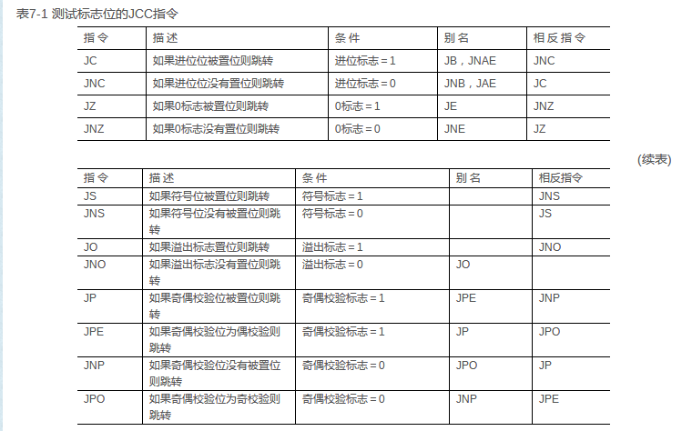

PASM笔记
====

mov    eax, 3   ; store 3 into eax
mov    bx, ax   ; store the value of ax into bx

add    eax, 4   ; eax = eax + 4
add    al, ah   ; al = al + ah

sub    bx, 10   ; bx = bx - 10
sub    ebx, edi ; ebx = ebx - edi

inc    ecx      ; ecx++
dec    dl       ; dl--

#Directives伪指令#
directive是汇编器特有的，而不是cpu特有的，可以用来声明变量，定义要存入的内存，
包含其他文件etc

另外NASM在编译是会通过一个预处理器，可以使用类似C语言一样的宏，不过使用 % 来声明


*symbol equ value*, equ指令,用来声明一个常量，不能被重新定义

The %define directive

%define SIZE 100
mov eax, SIZE

%define 与 equ 类似，不同之处在于可以redined，而且不仅仅可以定义常量

Data directives:

//RES means reverse
RESB (byte)
RESW (word)
RESD (double word)
RESQ (quad word)
REST (ten byte)

db   (byte)
dd   (double word) 可用于保存整型或浮点数

times用于重复指令
times 100 db 0 与 resw 100 效果相同，不过后者速度快

NASM 在表达式中支持两个特殊的记号，即'$'和'$$',它们允许引用当前指令 
的地址。'
$'计算得到它本身所在源代码行的开始处的地址；所以你可以简 单地写这样的代码'jmp $'来表示无限循环。
'$$'计算当前段开始处的地址， 所以你可以通过($-$$)找出你当前在段内的偏移。

常用表达式
```
|    bitwize or
^    bitwize xor
&    bitwize and
<<   bit-shift to left
>>   bit-shift to right
+    addition
-    substraction
*    multipication
/    unsigned division
//   signed division
%    unsigned mod
%%   signed mod
```
注意%是用于宏定义的，所以当做运算符使用时，%后面必须跟一个空格

单元运算符：
+  加号，不做任何作用
-  负号
～
！ 逻辑非

===

条件转移指令 JNE/JNZ
1. JNE 与 JNZ 等价，都是根据标志位ZF进行条件转移的指令
2. 常用来根据前一条指令使用
3. JNE，JNZ一个效果




###跳转指令  jmp、call、ret、retf
JMP、CALL和RET指令的近转移形式只是在当前代码段中执行程序控制转移，因此不会执行特权级检查。JMP、CALL或RET指令的远转移形式会把控制转移到另外一个代码段中，因此处理器一定会执行特权级检查。
 
1、jmp指令：不影响堆栈。紧紧进行执行流程的跳转，不会保存返回地址。(书P55)对于jmp而言，长短jmp仅仅是结果不同罢了，短跳转对应段内，长跳转对应段间。
 
2、call指令：影响堆栈。在进行流程跳转前会保存返回地址（下一条指令的地址），以便在跳转目标代码中可以使用ret指令返回到call指令的下一条指令处继续执行。执行段内跳转（或称“长call”）时，只保存EIP；如果是段间跳转（或称“短call”），还保存CS。
 
3、ret和retf：这两个指令的功能都是调用返回。
	（1）ret在返回时只从堆栈中取得EIP；retf中的字母f表示far，即段间转移返回，要从堆栈中取出EIP和CS。
	（2）两个指令都可以带参数，表示发生过程调用时参数的个数，返回时要从堆栈中退出相应个数的参数。
	（3）恢复CS时，如果发现将发生特权级变化（当前CS的低2位不等于从堆栈中取得的新的CS值的低2位。由跳转的相关理论可知，只有跳转到非一致代码段时才会发生特权级变化，那么，也只有从非一致代码段返回时才会发生特权级变化的返回），则还要从调用者堆栈中取得ESP和SS恢复到相应寄存器中，也即恢复调用者堆栈


