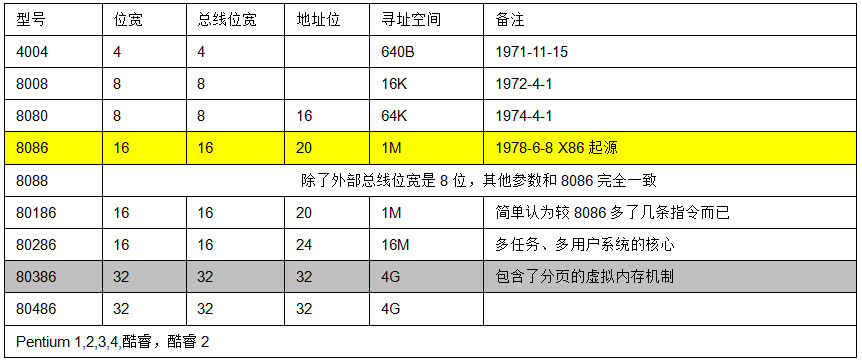
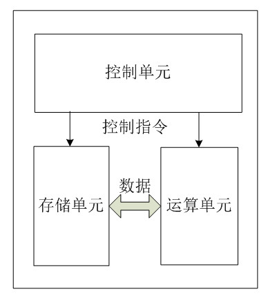
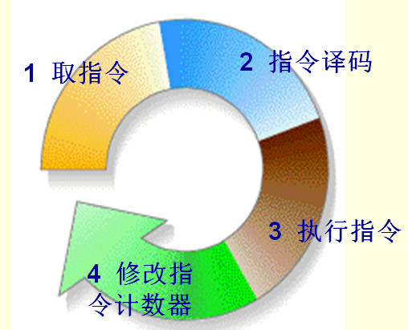

 CPU的内部架构和工作原理 
===

转载自:http://blog.chinaunix.net/uid-23069658-id-3563960.htm

直以来，总以为CPU内部真是如当年学习《计算机组成原理》时书上所介绍的那样，是各种逻辑门器件的组合。当看到纳米技术时就想，真的可以把那些器件做的那么小么？直到看了Intel CPU制作流程及AMD芯片的制作流程的介绍不禁感慨，原来科技是如此的发达。
本文我们以Intel为例对CPU的工作原理做简单介绍，仅仅是简单介绍，那么AMD，ARM，MIPS甚至PowerPC你应该会触类旁通才对。
还记得那是1968年7月18日，鲍勃-诺斯和戈登-摩尔的新公司在美国加利福尼亚州，美丽的圣弗朗西斯科湾畔芒延维尤城的梅多费大街365号开张了。并在成立不久斥资15000美元从一家叫INTELCO的公司手中买下了Intel名称的使用权。由此Intel这位半导体巨人开始了他在IT行业传奇般的历史。
   1971年11月15日，这一天被当作全球IT界具有里程碑意义的日子而被写入许多计算机专业教科书。Intel公司的工程师特德·霍夫发明了世界上第一个微处理器—4004，这款4位微处理器虽然只有45条指令，而且每秒只能执行5万条指令。甚至比不上1946年由美国陆军宾夕法尼亚大学研制的世界第一台计算机ENIAC。但它的集成度却要高很多，一块4004的重量还不到一盅司。 他因发明了微处理器，被英国《经济学家》杂志称为“第二次世界大战以来最有影响的科学家之一”。Intel公司的CPU发展历程如下表所示：

 以及后面的Pentium 1,2,3和4，再到酷睿、酷睿2，这里就不再一一列举。Intel从8086开始，就进入了我们所谓的x86时代。而80386的诞生则标志着Intel正是进入了32位微处理器的时代。从80386到Pentium 4这个年代的CPU，就是传说中的IA-32时代。
   我们都知道CPU的根本任务就是执行指令，对计算机来说最终都是一串由“0”和“1”组成的序列。CPU从逻辑上可以划分成3个模块，分别是控制单元、运算单元和存储单元，这三部分由CPU内部总线连接起来。如下所示：

##控制单元：##
控制单元是整个CPU的指挥控制中心，由指令寄存器IR(Instruction Register)、指令译码器ID(Instruction Decoder)和操作控制器OC(Operation Controller)等，对协调整个电脑有序工作极为重要。它根据用户预先编好的程序，依次从存储器中取出各条指令，放在指令寄存器IR中，通过指令译码(分析)确定应该进行什么操作，然后通过操作控制器OC，按确定的时序，向相应的部件发出微操作控制信号。操作控制器OC中主要包括节拍脉冲发生器、控制矩阵、时钟脉冲发生器、复位电路和启停电路等控制逻辑。
##运算单元：##
是运算器的核心。可以执行算术运算(包括加减乘数等基本运算及其附加运算)和逻辑运算(包括移位、逻辑测试或两个值比较)。相对控制单元而言，运算器接受控制单元的命令而进行动作，即运算单元所进行的全部操作都是由控制单元发出的控制信号来指挥的，所以它是执行部件。
##存储单元：##
包括CPU片内缓存和寄存器组，是CPU中暂时存放数据的地方，里面保存着那些等待处理的数据，或已经处理过的数据，CPU访问寄存器所用的时间要比访问内存的时间短。采用寄存器，可以减少CPU访问内存的次数，从而提高了CPU的工作速度。但因为受到芯片面积和集成度所限，寄存器组的容量不可能很大。寄存器组可分为专用寄存器和通用寄存器。专用寄存器的作用是固定的，分别寄存相应的数据。而通用寄存器用途广泛并可由程序员规定其用途，通用寄存器的数目因微处理器而异。这个是我们以后要介绍这个重点，这里先提一下。

我们将上图细化一下，可以得出CPU的工作原理概括如下：

总的来说，CPU从内存中一条一条地取出指令和相应的数据，按指令操作码的规定，对数据进行运算处理，直到程序执行完毕为止。
   上图中我没有画总线，只是用逻辑方式对其进行呈现。原因早期Intel的微处理器，诸如8085，8086/8088CPU，普遍采用了地址总线和数据总线复用技术，即将部分(或全部)地址总线与数据总线共用CPU的一些引脚。例如8086外部地址总线有20根，数据总线复用了地址总线的前16根引脚。复用的数据总线和地址总线虽然可以少CPU的引脚数，但却引入了控制逻辑及操作序列上的复杂性。所以，自80286开始，Intel的CPU才采用分开的地址总线和数据总线。
   不管是复用还是分开，对我们理解CPU的运行原理没啥影响，上图没画总线的目的就是怕有些人太过于追求细节，一头扎下去，浮不起来，不能从宏观上藐视敌人。
   OK，总结一下，CPU的运行原理就是：控制单元在时序脉冲的作用下，将指令计数器里所指向的指令地址(这个地址是在内存里的)送到地址总线上去，然后CPU将这个地址里的指令读到指令寄存器进行译码。对于执行指令过程中所需要用到的数据，会将数据地址也送到地址总线，然后CPU把数据读到CPU的内部存储单元(就是内部寄存器)暂存起来，最后命令运算单元对数据进行处理加工。周而复始，一直这样执行下去，天荒地老，海枯枝烂，直到停电。
   如果你对这段话还是觉得比较晕乎，那么就看我们老师是怎么讲的：
   1、取指令：CPU的控制器从内存读取一条指令并放入指令寄存器。指令的格式一般是这个样子滴：

操作码就是汇编语言里的mov,add,jmp等符号码；操作数地址说明该指令需要的操作数所在的地方，是在内存里还是在CPU的内部寄存器里。
   2、指令译码：指令寄存器中的指令经过译码，决定该指令应进行何种操作(就是指令里的操作码)、操作数在哪里(操作数的地址)。
   3、 执行指令，分两个阶段“取操作数”和“进行运算”。
   4、 修改指令计数器，决定下一条指令的地址。

关于CPU我们从宏观上把握到这个程度就OK了，后面我们会逐步进入微观阶段，依次介绍80X86寄存器及其用途，NASM汇编和AT&T的区别，以及C代码中嵌入的汇编语言的写法。之所以介绍汇编语言目的不是说用汇编去写代码，那是相当的不现实，除非你是硬件驱动工程师。稍微偏上层一点的开发人员懂点低等的东西，对自己理解整个系统的架构和原理是相当有好处的。

