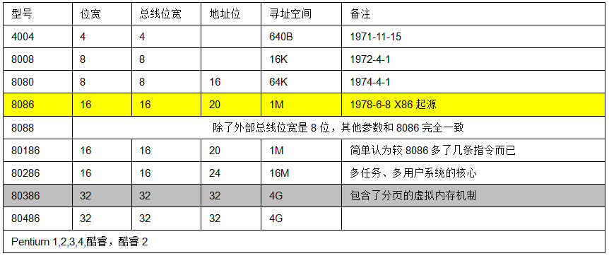
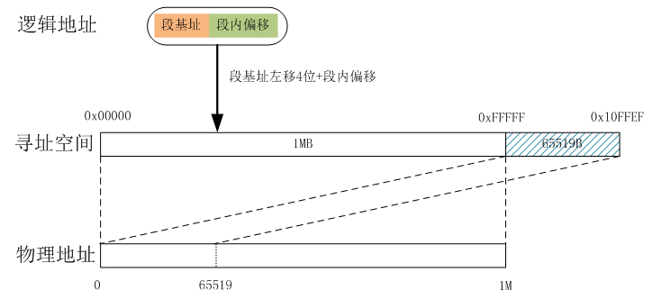

寻访x86处理器“实模式”和“保护模式”的前世今生 
===

转载自：http://blog.chinaunix.net/uid-23069658-id-3569341.html

还是把博文“CPU的内部架构和工作原理”里的这个表搬出来，祭奠那些不应该在岁月的洪荒中被淹埋的荣耀：

8086的诞生，标志着Intel 正式进入了x86时代，这是个多么具有纪念意义的日子：1978-6-8。同时，8086的诞生也是处理器内存寻址技术的第一次飞跃。
对于一根实际的、实实在在的、物理的、可看得见、摸得着的内存条而言，处理器把它当做8位一个字节的序列来管理和存取，每一个内存字节都有一个对应的地址，我们叫它物理地址，用地址可以表示的长度叫做寻址空间。而CPU是如何去访问内存单元里的数据的方式就叫做寻址。
8086得CPU在内存寻址方面第一次引入了一个非常重要的概念----段。在8086之前都是4位机和8位机的天下，那是并没有段的概念。当程序要访问内存时都是要给出内存的实际物理地址，这样在程序源代码中就会出现很多硬编码的物理地址。这样的程序可想而知，难重定位，可控性弱，结构丑陋，那个年代写这样的程序在我们现在看来是多么让人恼火的一件事儿。
8080问世后四年也就是1978年，Intel开始设计16位CPU，正常来说8086的寻址空间应该是216=64KB才对，但Intel就偏偏不这干，8086的目标寻址空间直指1M，也就是说8086的地址总线位宽要达到20位。如何让16位的内部寄存器对20位的外部地址空间进行寻址，Intel的工程师们从当时的PDP-11小型机身上找到了灵感。PDP-11是美国迪吉多电脑(Digital Equipment Corp.)公司于1970到1980年代热销的16位迷你电脑，PDP-11的内存管理单元(MMU)可以将16位地址映射到24位地址空间里(至于人家是怎么弄，我就真不晓得了)。
为了支持分段机制，Intel在8086的CPU里新增了4个寄存器，分别是代码段CS，数据段DS，堆栈段SS和其他ES(以后深入介绍一下这几个兄弟伙，这涉及到进程的在内存的运行情况)。这样一来，一个物理地址就由两个部分组成，分别是“段地址”:“段内偏移量”。例如，ES=0x1000，DI=0xFFFF，那么这个数据ES:DI在内存里的绝对物理地址就是：
AD(Absolute Address)=(ES)*(0x10)+(DI)=0x1FFFF
就是讲段基地址左移4位然后加上段内偏移量就得到了物理内存里的绝对地址，经过这么一个变换，就可以得到一个20位的地址，8086就可以对20位的1M内存空间进行寻址了。如下：

很明显，这种方式可以寻址的最高地址为0xFFFF:0xFFFF，其地址空间为0x00000~0x10FFEF，因为8086的地址总线是20位，最大只能访问到1MB的物理地址空间，即物理地址空间是0x00000~0xFFFFF。当程序访问0x100000~0x10FFEF这一段地址时，因为其逻辑上是正常的，CPU并不会认为其访问越界而产生异常，但这段地址确实没有实际的物理地址与其对应，怎么办？此时CPU采取的策略是，对于这部分超出1M地址空间的部分，自动将其从物理0地址处开始映射。也就是说，系统计算实际物理地址时是按照对1M求模运算的方式进行的，在有些技术文献里你会看到这种技术被称之为wrap-around。还是通过一幅图来描述一下吧：

根据前面的讲解我们可以发现段基址有个特征，其低4位全为0，也就是说每个段的起始地址一定是16的整数倍，这是分段的一个基本原则。这样每个段的最小长度是16字节，而最大长度只能是64KB。这里我们可以计算一下，1MB的物理地址空间能划分成多少个段。
如果每个段的长度为16字节，这样1MB物理地址空间最多可以划分成64K个段；
如果每个段的长度为64KB，那么1MB的物理地址空间最多能划分成16个段。
8086这种分段基址虽然实现了寻址空间的提升，但是也带来一些问题：
1、同一个物理地址可以有多种表示方法。例如0x01C0:0x0000和0x0000:0x1C00所表示的物理地址都是0x01C00。
2、地址空间缺乏保护机制。对于每一个由段寄存器的内容确定的“基地址”，一个进程总是能够访问从此开始64KB的连续地址空间，而无法加以限制。另一方面，可以用来改变段寄存器内容的指令也不是什么“特权指令”，也就是说，通过改变段寄存器的内容，一个进程可以随心所欲地访问内存中的任何一个单元，而丝毫不受限制。不能对一个进程的内存访问加以限制，也就谈不上对其他进程以及系统本身的保护。与此相应，一个CPU如果缺乏对内存访问的限制，或者说保护，就谈不上什么内存管理，也就谈不上是现代意义上的中央处理器。
总结一下：8086和后来的80186，这种只能访问1MB地址空间的工作模式，我们将其称之为“实模式”。我的理解就是“实际地址模式”,因为通过段基址和段偏移算出来的地址，经过模1MB之后得出来的地址都是实际内存的物理地址。
 
由于8086的上述问题，1982年，Intel在80286的CPU里，首次引入的地址保护的概念。也就是说80286的CPU能够对内存及一些其他外围设备做硬件级的保护设置（实质上就是屏蔽一些地址的访问）。自从最初的x86微处理器规格以后，它对程序开发完全向下兼容，80286芯片被制作成启动时继承了以前版本芯片的特性，工作在实模式下，在这种模式下实际上是关闭了新的保护功能特性，因此能使以往的软件继续工作在新的芯片下。后续的x86处理器都是在计算机加电启动时都是工作在实模式下。
也就是说，在保护模式下，程序不能再随意的访问物理内存了，有些内存地址CPU做了明确的保护限制。
1985年80386的问世，使Intel完成了从16位到32位CPU的飞跃，这中间80286毫无疑问的就成了这次飞跃的跳板。80286的地址线已经达到24位，可寻址空间是16MB，但Intel当初设计80286时提出的目标是向下兼容，这也是Intel一贯的作风，正是这种作风为Intel后面设计80386时增添了几根儿烦恼丝。所以，在“实模式”下，80286所表现的行为和8086所表现的完全一样。
80386是32位CPU，也就是说它的ALU数据总线是32位，地址总线的位宽和CPU内部数据总线的位宽是一致的，都是32位，其寻址范围可达4GB。如果重新设计80386的架构，其结构应该相当简洁才对。但是80386却很遗憾的无法做到这一点，作为一个产品系列中的成员分子，80386必须继续维持“前辈”们的那些段寄存器，必须支持实模式，同时还要支持保护模式。可以看得出来，80386其实也不容易。
 
所以，Intel决定在80386的段寄存器(CS,DS,SS,ES)的基础上构筑保护模式，并且继续保留段寄存器为16位,同时又增添了两个段寄存器FS和GS。显然，为了实现保护模式，光是用段寄存器来确定一个基地址是不够的，至少还要有一个地址段的长度，并且还需要一些诸如访问权限之类的其他信息。所以，这里需要的是一个数据结构(这个数据结构就叫做“段描述符”，以后会看到)，而并非一个单纯的基地址。对此， Intel设计人员的基本思路是：
在保护模式下改变段寄存器的功能，使其从一个单纯的段基址变成指向一个“段描述符”的指针。因此，当一个访存指令发出一个内存地址时， CPU按照下面过程实现从指令中的32位逻辑地址到32位线性地址，再到物理地址的转换：
1、首先根据指令的性质来确定该使用哪一个段寄存器，例如操作指令中的地址在代码段CS里，而数据指令中的地址在数据段DS里。这一点与实地址模式相同。
2、根据段寄存器里的内容，找到相应的“段描述符”结构。
3、然后，从“段描述符”里得到的才是段基址。
4、将指令中的地址作为偏移量，然后和段描述符结构中规定的段长度进行比较，看齐是否越界。
5、根据指令的性质和段描述符中的访问权限来确定当前指令操作是否越权。
6、最后才将指令中的地址作为偏移量，与段基址相加得到线性地址，或者叫虚拟地址。
7、最后根据线性地址算出实际的物理地址。
所以，实模式就是80186及其之前的CPU只能寻址1MB物理地址空间，且寻到的就是实实在在的物理地址的模式，用户程序想干啥干啥，无法无天；而保护模式，就是说用户成的程序，某些地址你是不能访问的，或者说是有限制性的访问，且你访问到的地址不再是物理地址了，而是一个虚拟的地址。这个虚拟地址要经过一系列算法处理，最终映射到实际物理地址单元里去。
现在运行在X86CPU上的主流操作系统，如Linux，FreeBSD，Windows95以后的版本以及OS/2等都是工作在保护模式下。一般情况下，处理器只有在上电启动，引导阶段，初始化系统时才会进入实模式，当实模式阶段的任务完成后，它就切换到了保护模式。当切换到保护模式后就很难再回到实模式了，几乎不可能。(注意我的用词)
