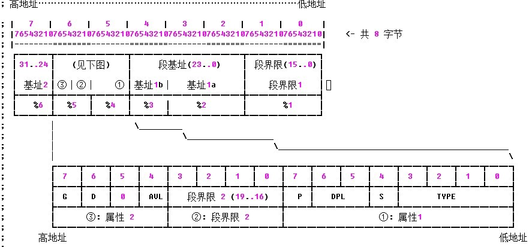

#GDT(Global Descriptor Table)全局描述表#
在整个系统中，全局描述表只有一张（一个处理器对应一个GDT),GDT可以在
内存的任何位置，但是CPU必须知道GDT的入口(GDT的基地址), Intel专门提供
了一个寄存器 GDTR 用来存放GDT的入口地址，程序员初始化在内存中的某处初始化
完GDT后，可以通过LGDT指令将GDT的入口地址装入寄存器，此后cpu就能根据此寄存器
中的内容作为GDT的入口来访问GDT了。GDTR存放的是GDT的基地址和表长度(GDT的字节长度值）
,故 GDTR的位数是32+16=48位)

汇编不支持LGDT/SGDT指令,需要自己查intel手册进行中断。。。

GDT主要是用于分段处理，为了能使用segmentation,每个段都需要清楚
的表明一下信息
1. 段的大小
2. 段在内存的开始位置
3. 段的管理属性，比如只读，系统专用

由于32/16位下的段寄存器总是16位的，但由于cpu设计问题，最低三位不能用，故最多可以有2^13 = 8192个段

另外每个segmentation的描述需要8byte，所以gdt最多需要64kb的存储空间，故只能将GDT放在内存中。

#GDT结构#



伪代码结构
```
struc gdt_entry_struct

        limit_low:   resb 2
        base_low:    resb 2
        base_middle: resb 1
        access:      resb 1
        granularity: resb 1
        base_high:   resb 1

endstruc
```

nasm的宏定义
```
;usage: Descriptor Base,Limit,Attr
;    Base:  dd (32bits段基址)
;    Limit: dd (low 20 bits available, 20bits 段界限)
;    Attr : dw (lower 4 bits of higher byte are always 0)

%macro Descriptor 3

dw	%2 & 0FFFFh				; 段界限1

dw	%1 & 0FFFFh				; 段基址1

db	(%1 >> 16) & 0FFh			; 段基址2

dw	((%2 >> 8) & 0F00h) | (%3 & 0F0FFh)	; 属性1 + 段界限2 + 属性2

db	(%1 >> 24) & 0FFh			; 段基址3

%endmacro 					; 共 8 字节
```

#结构说明#
(1) P:    存在(Present)位。
    P=1 表示描述符对地址转换是有效的，或者说该描述符所描述的段存在，即在内存中；

    P=0 表示描述符对地址转换无效，即该段不存在。使用该描述符进行内存访问时会引起异常。

(2) DPL:  表示描述符特权级(Descriptor Privilege level)，共2位。它规定了所描述段的特权级，用于特权检查，以决定对该段能否访问。 

(3) S:   说明描述符的类型。

    对于存储段描述符而言，S=1，以区别与系统段描述符和门描述符(S=0)。 

(4) TYPE: 说明存储段描述符所描述的存储段的具体属性。

	数据段类型

	0	只读 

;	1	只读、已访问 

;	2	读/写 

;	3	读/写、已访问 

;	4	只读、向下扩展 

;	5	只读、向下扩展、已访问 

;	6	读/写、向下扩展 

;	7	读/写、向下扩展、已访问 


	代码段类型

;	8	只执行 

;	9	只执行、已访问 

;	A	执行/读 

;	B	执行/读、已访问 

;	C	只执行、一致码段 

;	D	只执行、一致码段、已访问 

;	E	执行/读、一致码段 

;	F	执行/读、一致码段、已访问 


	系统段类型	

;	0	<未定义>

;	1	可用286TSS

;	2	LDT

;	3	忙的286TSS

;	4	286调用门

;	5	任务门

;	6	286中断门

;	7	286陷阱门

;	8	未定义

;	9	可用386TSS

;	A	<未定义>

;	B	忙的386TSS

;	C	386调用门

;	D	<未定义>

;	E	386中断门

;	F	386陷阱门

(5) G:    段界限粒度(Granularity)位。
    G=0 表示界限粒度为字节；
    G=1 表示界限粒度为4K 字节
    注意，界限粒度只对段界限有效，对段基地址无效，段基地址总是以字节为单位。 
(6) D:    D位是一个很特殊的位，在描述可执行段、向下扩展数据段或由SS寄存器寻址的段(通常是堆栈段)的三种描述符中的意义各不相同。 

    ⑴ 在描述可执行段的描述符中，D位决定了指令使用的地址及操作数所默认的大小。

;	① D=1表示默认情况下指令使用32位地址及32位或8位操作数，这样的代码段也称为32位代码段；

;	② D=0 表示默认情况下，使用16位地址及16位或8位操作数，这样的代码段也称为16位代码段，它与80286兼容。可以使用地址大小前缀和操作数大小前缀分别改;变默认的地址或操作数的大小。 

;           ⑵ 在向下扩展数据段的描述符中，D位决定段的上部边界。

;	① D=1表示段的上部界限为4G；

;	② D=0表示段的上部界限为64K，这是为了与80286兼容。 

;           ⑶ 在描述由SS寄存器寻址的段描述符中，D位决定隐式的堆栈访问指令(如PUSH和POP指令)使用何种堆栈指针寄存器。

;	① D=1表示使用32位堆栈指针寄存器ESP；

;	② D=0表示使用16位堆栈指针寄存器SP，这与80286兼容。 

 (7) AVL:  软件可利用位。80386对该位的使用未左规定，Intel公司也保证今后开发生产的处理器只要与80386兼容，就不会对该位的使用做任何定义或规定。 
