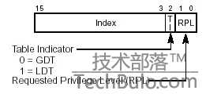

#GDT(Global Descriptor Table)全局描述表#
在整个系统中，全局描述表只有一张（一个处理器对应一个GDT),GDT可以在
内存的任何位置，但是CPU必须知道GDT的入口(GDT的基地址), Intel专门提供
了一个寄存器 GDTR 用来存放GDT的入口地址，程序员初始化在内存中的某处初始化
完GDT后，可以通过LGDT指令将GDT的入口地址装入寄存器，此后cpu就能根据此寄存器
中的内容作为GDT的入口来访问GDT了。GDTR存放的是GDT的基地址和表长度(GDT的字节长度值）
,故 GDTR的位数是32+16=48位)

汇编不支持LGDT/SGDT指令,需要自己查intel手册进行中断。。。

GDT主要是用于分段处理，为了能使用segmentation,每个段都需要清楚
的表明一下信息
1. 段的大小
2. 段在内存的开始位置
3. 段的管理属性，比如只读，系统专用

由于32/16位下的段寄存器总是16位的，但由于cpu设计问题，最低三位不能用，故最多可以有2^13 = 8192个段

另外每个segmentation的描述需要8byte，所以gdt最多需要64kb的存储空间，故只能将GDT放在内存中。

#GDT结构#


伪代码结构
```
struc gdt_entry_struct

        limit_low:   resb 2
        base_low:    resb 2
        base_middle: resb 1
        access:      resb 1
        granularity: resb 1
        base_high:   resb 1

endstruc
```

nasm的宏定义
```
;usage: Descriptor Base,Limit,Attr
;    Base:  dd (32bits段基址)
;    Limit: dd (low 20 bits available, 20bits 段界限)
;    Attr : dw (lower 4 bits of higher byte are always 0)

%macro Descriptor 3

dw      %2 & 0FFFFh                             ; 段界限1

dw      %1 & 0FFFFh                             ; 段基址1

db      (%1 >> 16) & 0FFh                       ; 段基址2

dw      ((%2 >> 8) & 0F00h) | (%3 & 0F0FFh)     ; 属性1 + 段界限2 + 属性2

db      (%1 >> 24) & 0FFh                       ; 段基址3

%endmacro                                       ; 共 8 字节
```

#结构说明#
(1) P:    存在(Present)位。
    P=1 表示描述符对地址转换是有效的，或者说该描述符所描述的段存在，即在内存中；

    P=0 表示描述符对地址转换无效，即该段不存在。使用该描述符进行内存访问时会引起异常。

(2) DPL:  表示描述符特权级(Descriptor Privilege level)，共2位。它规定了所描述段的特权级，用于特权检查，以决定对该段能否访问。 

(3) S:   说明描述符的类型。

    对于存储段描述符而言，S=1，以区别与系统段描述符和门描述符(S=0)。 

(4) TYPE: 说明存储段描述符所描述的存储段的具体属性。

	数据段类型

	0	只读 

;	1	只读、已访问 

;	2	读/写 

;	3	读/写、已访问 

;	4	只读、向下扩展 

;	5	只读、向下扩展、已访问 

;	6	读/写、向下扩展 

;	7	读/写、向下扩展、已访问 


	代码段类型

;	8	只执行 

;	9	只执行、已访问 

;	A	执行/读 

;	B	执行/读、已访问 

;	C	只执行、一致码段 

;	D	只执行、一致码段、已访问 

;	E	执行/读、一致码段 

;	F	执行/读、一致码段、已访问 


	系统段类型	

;	0	<未定义>

;	1	可用286TSS

;	2	LDT

;	3	忙的286TSS

;	4	286调用门

;	5	任务门

;	6	286中断门

;	7	286陷阱门

;	8	未定义

;	9	可用386TSS

;	A	<未定义>

;	B	忙的386TSS

;	C	386调用门

;	D	<未定义>

;	E	386中断门

;	F	386陷阱门

(5) G:    段界限粒度(Granularity)位。
    G=0 表示界限粒度为字节；
    G=1 表示界限粒度为4K 字节
    注意，界限粒度只对段界限有效，对段基地址无效，段基地址总是以字节为单位。 
(6) D:    D位是一个很特殊的位，在描述可执行段、向下扩展数据段或由SS寄存器寻址的段(通常是堆栈段)的三种描述符中的意义各不相同。 

    ⑴ 在描述可执行段的描述符中，D位决定了指令使用的地址及操作数所默认的大小。

;	① D=1表示默认情况下指令使用32位地址及32位或8位操作数，这样的代码段也称为32位代码段；

;	② D=0 表示默认情况下，使用16位地址及16位或8位操作数，这样的代码段也称为16位代码段，它与80286兼容。可以使用地址大小前缀和操作数大小前缀分别改;变默认的地址或操作数的大小。 

;           ⑵ 在向下扩展数据段的描述符中，D位决定段的上部边界。

;	① D=1表示段的上部界限为4G；

;	② D=0表示段的上部界限为64K，这是为了与80286兼容。 

;           ⑶ 在描述由SS寄存器寻址的段描述符中，D位决定隐式的堆栈访问指令(如PUSH和POP指令)使用何种堆栈指针寄存器。

;	① D=1表示使用32位堆栈指针寄存器ESP；

;	② D=0表示使用16位堆栈指针寄存器SP，这与80286兼容。 

 (7) AVL:  软件可利用位。80386对该位的使用未左规定，Intel公司也保证今后开发生产的处理器只要与80386兼容，就不会对该位的使用做任何定义或规定。 

#段选择子Selector#

转载自：http://www.techbulo.com/708.html
由GDTR访问全局描述符表是通过 "段选择子" （实模式下称之为段寄存器）来完成的，段选择子(段寄存器）是一个16位的寄存器。


段选择子包括三部分：描述符索引（index）、TI、请求特权级（RPL）
TI (Table Indicator):
0 = GDT 选择子在GDT中选择
1 = LDT 选择子在LDT中选择

请求特权级(RPL)表示选择子的特权级，共有（0，1，2，3 四个级别)

关于特权级的说明：任务中的每一个段都有一个特定的级别。每当一个程序试图访问某一个段时，就将该程序所拥有的特权级与要访问的特权级进行比较，以决定能否访问该段。系统约定，CPU只能访问同一特权级或级别较低特权级的段。

例如给出逻辑地址：21h:12345678h转换为线性地址

a. 选择子SEL=21h=0000000000100 0 01b 他代表的意思是：选择子的index=4即100b选择GDT中的第4个描述符；TI=0代表选择子是在GDT选择；左后的01b代表特权级RPL=1

b. OFFSET=12345678h若此时GDT第四个描述符中描述的段基址（Base）为11111111h，则线性地址=11111111h+12345678h=23456789h


#LDT局部描述符表#


LDT和GDT从本质上说是相同的，只是LDT嵌套在GDT之中。LDTR记录局部描述符表的起始位置，与GDTR不同，LDTR的内容是一个段选择子。由于LDT本身同样是一段内存，也是一个段，所以它也有个描述符描述它，这个描述符就存储在GDT中，对应这个表述符也会有一个选择子，LDTR装载的就是这样一个选择子。LDTR可以在程序中随时改变，通过使用lldt指令。如上图，如果装载的是Selector 2则LDTR指向的是表LDT2。举个例子：如果我们想在表LDT2中选择第三个描述符所描述的段的地址12345678h。

1. 首先需要装载LDTR使它指向LDT2 使用指令lldt将Select2装载到LDTR

2. 通过逻辑地址（SEL:OFFSET）访问时SEL的index=3代表选择第三个描述符；TI=1代表选择子是在LDT选择，此时LDTR指向的是LDT2,所以是在LDT2中选择，此时的SEL值为1Ch(二进制为11 1 00b)。OFFSET=12345678h。逻辑地址为1C:12345678h

3. 由SEL选择出描述符，由描述符中的基址（Base）加上OFFSET可得到线性地址，例如基址是11111111h，则线性地址=11111111h+12345678h=23456789h

4. 此时若再想访问LDT1中的第三个描述符，只要使用lldt指令将选择子Selector 1装入再执行2、3两步就可以了（因为此时LDTR又指向了LDT1）

由于每个进程都有自己的一套程序段、数据段、堆栈段，有了局部描述符表则可以将每个进程的程序段、数据段、堆栈段封装在一起，只要改变LDTR就可以实现对不同进程的段进行访问。

当进行任务切换时，处理器会把新任务LDT的段选择符和段描述符自动地加载进LDTR中。在机器加电或处理器复位后，段选择符和基地址被默认地设置为0，而段长度被设置成0xFFFF。

#访问gdt，ldt的实例#

访问GDT

当TI=0时表示段描述符在GDT中，如上图所示：

①先从GDTR寄存器中获得GDT基址。

②然后再GDT中以段选择器高13位位置索引值得到段描述符。

③段描述符符包含段的基址、限长、优先级等各种属性，这就得到了段的起始地址（基址），再以基址加上偏移地址yyyyyyyy才得到最后的线性地址。


访问LDT

当TI=1时表示段描述符在LDT中，如上图所示：

①还是先从GDTR寄存器中获得GDT基址。

②从LDTR寄存器中获取LDT所在段的位置索引(LDTR高13位)。

③以这个位置索引在GDT中得到LDT段描述符从而得到LDT段基址。

④用段选择器高13位位置索引值从LDT段中得到段描述符。

⑤段描述符符包含段的基址、限长、优先级等各种属性，这就得到了段的起始地址（基址），再以基址加上偏移地址yyyyyyyy才得到最后的线性地址。

#其他#
除了GDTR、LDTR外还有IDTR和TR

（1）中断描述符表寄存器IDTR 

与GDTR的作用类似，IDTR寄存器用于存放中断描述符表IDT的32位线性基地址和16位表长度值。指令LIDT和SIDT分别用于加载和保存IDTR寄存器的内容。在机器刚加电或处理器复位后，基地址被默认地设置为0，而长度值被设置成0xFFFF。

（2）任务寄存器TR

TR用于寻址一个特殊的任务状态段（Task State Segment，TSS）。TSS中包含着当前执行任务的重要信息。

TR寄存器用于存放当前任务TSS段的16位段选择符、32位基地址、16位段长度和描述符属性值。它引用GDT表中的一个TSS类型的描述符。指令LTR和STR分别用于加载和保存TR寄存器的段选择符部分。当使用LTR指令把选择符加载进任务寄存器时，TSS描述符中的段基地址、段限长度以及描述符属性会被自动加载到任务寄存器中。当执行任务切换时，处理器会把新任务的TSS的段选择符和段描述符自动加载进任务寄存器TR中。

